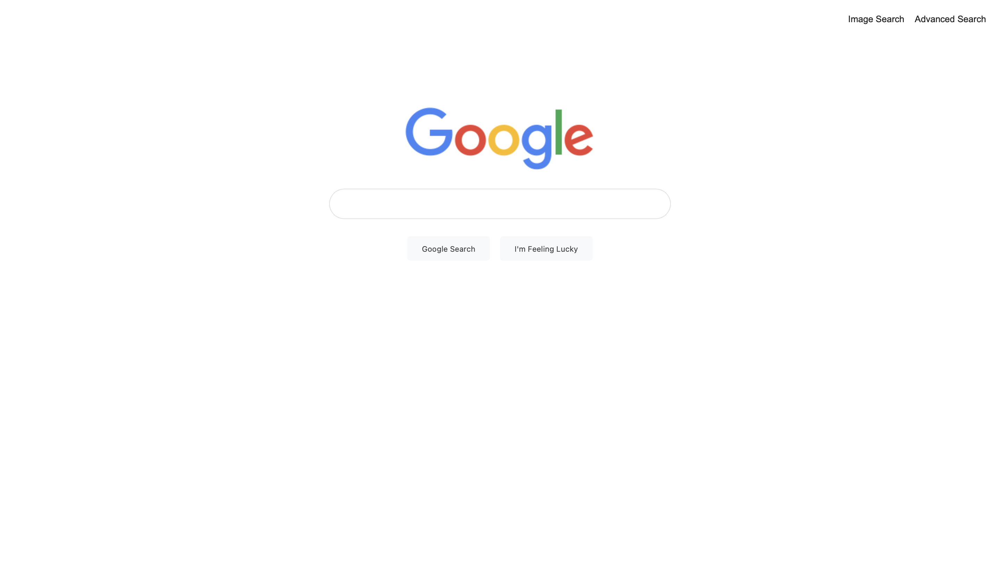

# Project 0: Google Search

Este é o **Projeto 0** do curso CS50’s Web Programming with Python and JavaScript (CS50W) da Universidade de Harvard. O objetivo deste projeto foi desenvolver o front-end do Google, imitando sua estética e conectando os formulários aos servidores reais de busca.

## 📌 Funcionalidades Implementadas

O projeto atende a todas as especificações do curso:

* **Múltiplas Páginas:** Navegação fluida entre Pesquisa Normal (`index.html`), Pesquisa de Imagens (`image.html`) e Pesquisa Avançada (`advanced.html`).
* **Google Search:** Barra de pesquisa estilizada e envio de requisições `GET` através do parâmetro `q`.
* **Google Image Search:** Redirecionamento direto para a aba de imagens utilizando o parâmetro oculto `tbm=isch`.
* **Google Advanced Search:** Formulário complexo utilizando parâmetros de busca específica (`as_q`, `as_epq`, `as_oq`, `as_eq`), com inputs empilhados verticalmente e alinhados à esquerda.
* **I'm Feeling Lucky:** Botão estilizado que redireciona o usuário diretamente para o primeiro resultado da busca (passando pelo aviso de redirecionamento de segurança).
* **Estética (CSS):** Design responsivo construído com **Flexbox**, dispensando o uso de tabelas ou frameworks externos.

## 🚀 Como Executar

Por ser um projeto puramente estático (sem rotas de servidor Python ainda), a execução é imediata:

1. Acesse a pasta do projeto.
2. Dê um duplo clique no arquivo `index.html` para abri-lo em qualquer navegador de sua preferência.

## 📸 Demonstração visual

